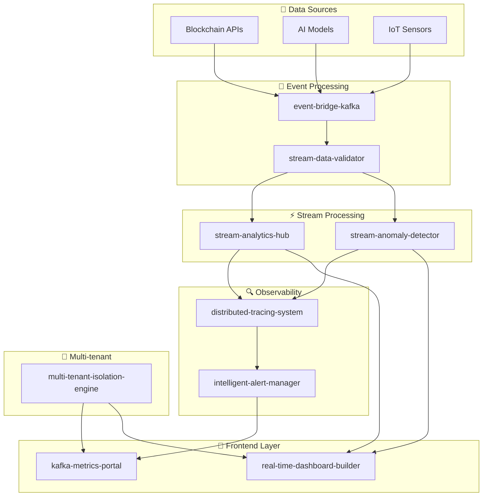

<div align="center">

# 🚀 StreamForge

**Complete microservices ecosystem for stream processing, real-time data analytics, and enterprise observability**

[](https://opensource.org/licenses/MIT)
[](https://www.docker.com/)
[](https://kubernetes.io/)
[](https://prometheus.io/)
[](https://grafana.com/)

[📖 Documentation](#-documentation) • [🚀 Quick Start](#-quick-start) • [🏗️ Architecture](#️-architecture) • [📊 Projects](#-projects) • [🤝 Contributing](#-contributing)

</div>

---

## 📋 Table of Contents

- [🎯 Features](#-features)
- [🏗️ Architecture](#️-architecture)
- [📊 Projects](#-projects)
- [🚀 Quick Start](#-quick-start)
- [🛠️ Technology Stack](#️-technology-stack)
- [📈 Roadmap](#-roadmap)
- [📚 Documentation](#-documentation)
- [🤝 Contributing](#-contributing)
- [📄 License](#-license)

## 🎯 Características

### ✨ **Funcionalidades Principales**
- 🔄 **Procesamiento de Streams en Tiempo Real** - Kafka + KSQLDB + Flink
- 🤖 **Machine Learning Integrado** - Detección de anomalías con TensorFlow
- 📊 **Dashboards Interactivos** - Constructor drag-and-drop con Angular
- 🔍 **Trazabilidad Distribuida** - OpenTelemetry + Jaeger
- 🚨 **Alertas Inteligentes** - ML para reducir alert fatigue
- 🏢 **Multi-tenant** - Aislamiento completo entre tenants
- 📈 **Observabilidad Completa** - Prometheus + Grafana + Jaeger

### 🎨 **Interfaz de Usuario**
- **Dashboard Builder** - Constructor visual sin código
- **Métricas en Tiempo Real** - WebSocket + Server-Sent Events
- **Exportación** - PDF, PNG, JSON
- **Templates** - Predefinidos para diferentes casos de uso

### 🔧 **DevOps & Infraestructura**
- **Docker Compose** - Desarrollo local completo
- **Kubernetes** - Despliegue en producción
- **CI/CD** - GitHub Actions integrado
- **Monitoring** - Prometheus + Grafana + Jaeger

## 🏗️ Arquitectura



## 📊 Proyectos

### 🏗️ **Proyectos Base (5 existentes)**

| # | Proyecto | Descripción | Stack | Estado |
|---|----------|-------------|-------|--------|
| 1️⃣ | **[event-bridge-kafka](./projects/event-bridge-kafka/)** | Gateway de eventos blockchain/IA | NestJS • KafkaJS • Docker | ✅ |
| 2️⃣ | **[stream-anomaly-detector](./projects/stream-anomaly-detector/)** | ML en tiempo real | FastAPI • TensorFlow • Kafka | ✅ |
| 3️⃣ | **[stream-analytics-hub](./projects/stream-analytics-hub/)** | KSQLDB + Flink | KSQLDB • Flink • Prometheus | ✅ |
| 4️⃣ | **[kafka-metrics-portal](./projects/kafka-metrics-portal/)** | UI de métricas | React • NestJS • Grafana | ✅ |
| 5️⃣ | **[log-replay-simulator](./projects/log-replay-simulator/)** | Simulador de tráfico | Python • Kafka • Docker | ✅ |

### 🆕 **Proyectos Nuevos (5 propuestos)**

| # | Proyecto | Descripción | Stack | Estado |
|---|----------|-------------|-------|--------|
| 6️⃣ | **[distributed-tracing-system](./projects/distributed-tracing-system/)** | Trazabilidad distribuida | Go • OpenTelemetry • Jaeger | 🚧 |
| 7️⃣ | **[intelligent-alert-manager](./projects/intelligent-alert-manager/)** | Alertas inteligentes | Python • TensorFlow • Redis | 🚧 |
| 8️⃣ | **[real-time-dashboard-builder](./projects/real-time-dashboard-builder/)** | Constructor de dashboards | Angular • D3.js • WebSocket | 🚧 |
| 9️⃣ | **[stream-data-validator](./projects/stream-data-validator/)** | Validador de datos | Go • Avro • Kafka | 🚧 |
| 🔟 | **[multi-tenant-isolation-engine](./projects/multi-tenant-isolation-engine/)** | Aislamiento multi-tenant | Go • K8s • Istio • Vault | 🚧 |

## 🚀 Inicio Rápido

### 📋 **Prerrequisitos**
- Docker & Docker Compose
- Git
- Make (opcional)

### 🔧 **Instalación**

```bash
# 1. Clonar el repositorio
git clone https://github.com/Franklin-Osede/stream-forge.git
cd stream-forge

# 2. Levantar todo el ecosistema
make up

# 3. Verificar estado
make status

# 4. Ver logs
make logs
```

### 🌐 **Acceso a Servicios**

| Servicio | URL | Descripción |
|----------|-----|-------------|
| **Grafana** | http://localhost:3000 | Dashboards y visualizaciones |
| **Prometheus** | http://localhost:9090 | Métricas y alertas |
| **Jaeger** | http://localhost:16686 | Trazabilidad distribuida |
| **Kafka UI** | http://localhost:8080 | Gestión de Kafka |

### 🛠️ **Comandos Útiles**

```bash
# Ver ayuda
make help

# Levantar servicios específicos
make up-project PROJECT=event-bridge-kafka

# Ver logs de un proyecto
make logs-project PROJECT=event-bridge-kafka

# Parar todo
make down

# Limpiar completamente
make clean

# Ejecutar tests
make test

# Formatear código
make format
```

## 🛠️ Stack Tecnológico

### 🔧 **Backend**
```yaml
Lenguajes:
  - Go: distributed-tracing-system, stream-data-validator, multi-tenant-isolation-engine
  - Python: stream-anomaly-detector, intelligent-alert-manager
  - Node.js: event-bridge-kafka, kafka-metrics-portal
  - Java: stream-analytics-hub

Frameworks:
  - NestJS: APIs REST y microservicios
  - FastAPI: APIs de alta performance
  - Spring Boot: Aplicaciones empresariales
```

### 🎨 **Frontend**
```yaml
Framework: Angular 17+ • TypeScript • RxJS
UI: Angular Material • Angular CDK
Charts: D3.js • Chart.js • ngx-charts
Real-time: WebSocket • Server-Sent Events
```

### 🏗️ **Infraestructura**
```yaml
Orquestación: Docker • Kubernetes • Istio
Streaming: Apache Kafka • KSQLDB • Apache Flink
Observabilidad: Prometheus • Grafana • Jaeger
Seguridad: Vault • JWT • OAuth2
```

### 🤖 **Machine Learning**
```yaml
Frameworks: TensorFlow • Scikit-learn
Modelos: Isolation Forest • LSTM • Autoencoder
Deployment: TensorFlow Lite • ONNX
```

## 📈 Roadmap

### 🎯 **Fase 1: Base (2-3 meses)**
- [x] event-bridge-kafka
- [x] log-replay-simulator  
- [ ] distributed-tracing-system

### 🎯 **Fase 2: Core Analytics (2-3 meses)**
- [x] stream-analytics-hub
- [ ] stream-data-validator
- [x] kafka-metrics-portal

### 🎯 **Fase 3: Intelligence (2-3 meses)**
- [x] stream-anomaly-detector
- [ ] intelligent-alert-manager

### 🎯 **Fase 4: User Experience (2-3 meses)**
- [ ] real-time-dashboard-builder

### 🎯 **Fase 5: Enterprise (2-3 meses)**
- [ ] multi-tenant-isolation-engine

## 📚 Documentación

### 📖 **Guías Principales**
- [🚀 Guía de Desarrollo](./docs/development.md) - Configuración del entorno
- [🏗️ Arquitectura](./docs/architecture.md) - Diseño del sistema
- [🚀 Deployment](./docs/deployment.md) - Guía de despliegue
- [📊 API Reference](./docs/api-reference.md) - Documentación de APIs

### 🔧 **Configuración**
- [⚙️ Variables de Entorno](./docs/environment-variables.md)
- [🐳 Docker](./docs/docker.md)
- [☸️ Kubernetes](./docs/kubernetes.md)
- [📊 Monitoreo](./docs/monitoring.md)

### 🎯 **Casos de Uso**
- [₿ Blockchain Analytics](./docs/use-cases/blockchain-analytics.md)
- [🌐 IoT Monitoring](./docs/use-cases/iot-monitoring.md)
- [🤖 ML Model Monitoring](./docs/use-cases/ml-monitoring.md)
- [🏦 Financial Services](./docs/use-cases/financial-services.md)

## 🤝 Contribuir

¡Las contribuciones son bienvenidas! Por favor, lee nuestra [Guía de Contribución](./docs/contributing.md) para más detalles.

### 🚀 **Proceso de Contribución**

1. **Fork** el proyecto
2. **Crea** tu feature branch (`git checkout -b feature/AmazingFeature`)
3. **Commit** tus cambios (`git commit -m 'Add some AmazingFeature'`)
4. **Push** a la branch (`git push origin feature/AmazingFeature`)
5. **Abre** un Pull Request

### 🐛 **Reportar Issues**

Si encuentras un bug o tienes una sugerencia, por favor [abre un issue](https://github.com/Franklin-Osede/stream-forge/issues).

### 💡 **Ideas y Sugerencias**

¿Tienes una idea genial? ¡Nos encantaría escucharla! Abre un [discussion](https://github.com/Franklin-Osede/stream-forge/discussions).

## 📊 Estadísticas del Proyecto


## 🏆 Casos de Uso

### 🏦 **Fintech**
- Monitoreo de transacciones en tiempo real
- Detección de fraudes con ML
- Análisis de riesgo crediticio

### 🌐 **IoT**
- Agregación de datos de sensores
- Detección de anomalías en dispositivos
- Optimización de eficiencia energética

### 🤖 **AI/ML**
- Monitoreo de modelos en producción
- Detección de drift de datos
- Optimización de performance

### 🎮 **Gaming**
- Análisis de comportamiento de jugadores
- Detección de bots y cheats
- Optimización de matchmaking

## 📄 Licencia

Este proyecto está bajo la Licencia MIT. Ver el archivo [LICENSE](LICENSE) para más detalles.

## 🆘 Soporte

### 📞 **Canales de Soporte**
- 📧 **Email**: support@streamforge.dev
- 💬 **Discord**: [StreamForge Community](https://discord.gg/streamforge)
- 📖 **Wiki**: [Documentación Completa](https://wiki.streamforge.dev)
- 🐛 **Issues**: [GitHub Issues](https://github.com/Franklin-Osede/stream-forge/issues)

### 🤝 **Comunidad**
- [Discussions](https://github.com/Franklin-Osede/stream-forge/discussions) - Preguntas y debates
- [Wiki](https://github.com/Franklin-Osede/stream-forge/wiki) - Documentación colaborativa
- [Releases](https://github.com/Franklin-Osede/stream-forge/releases) - Notas de versiones

---

<div align="center">

**Hecho con ❤️ por el equipo StreamForge**

[⭐ Star este proyecto](https://github.com/Franklin-Osede/stream-forge) • [🐛 Reportar bug](https://github.com/Franklin-Osede/stream-forge/issues) • [💡 Sugerir feature](https://github.com/Franklin-Osede/stream-forge/discussions)

</div>
