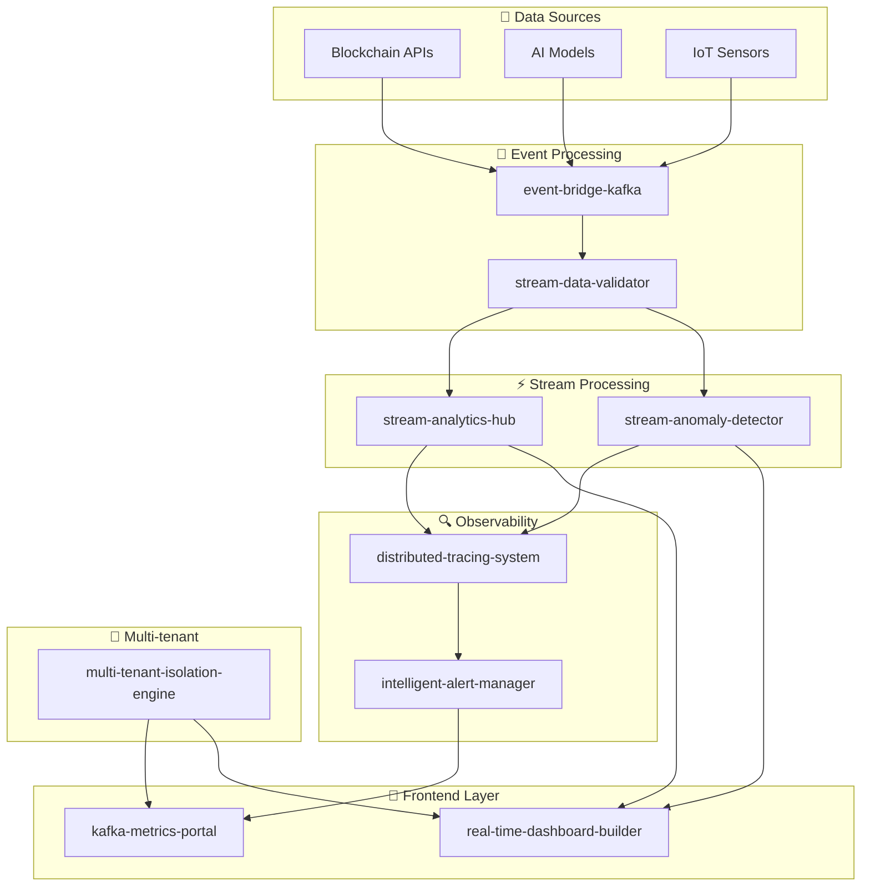

<div align="center">

# 🚀 StreamForge

**Complete microservices ecosystem for stream processing, real-time data analytics, and enterprise observability**

[](https://opensource.org/licenses/MIT)
[](https://www.docker.com/)
[](https://kubernetes.io/)
[](https://prometheus.io/)
[](https://grafana.com/)

[📖 Documentation](#-documentation) • [🚀 Quick Start](#-quick-start) • [🏗️ Architecture](#️-architecture) • [📊 Projects](#-projects) • [🤝 Contributing](#-contributing)

</div>

---

## 📋 Table of Contents

- [🎯 Features](#-features)
- [🏗️ Architecture](#️-architecture)
- [📊 Projects](#-projects)
- [🚀 Quick Start](#-quick-start)
- [🛠️ Technology Stack](#️-technology-stack)
- [📈 Roadmap](#-roadmap)
- [📚 Documentation](#-documentation)
- [🤝 Contributing](#-contributing)
- [📄 License](#-license)

## 🎯 Features

### ✨ **Core Capabilities**
- 🔄 **Real-time Stream Processing** - Kafka + KSQLDB + Flink
- 🤖 **Integrated Machine Learning** - Anomaly detection with TensorFlow
- 📊 **Interactive Dashboards** - Drag-and-drop builder with Angular
- 🔍 **Distributed Tracing** - OpenTelemetry + Jaeger
- 🚨 **Intelligent Alerting** - ML to reduce alert fatigue
- 🏢 **Multi-tenant** - Complete isolation between tenants
- 📈 **Full Observability** - Prometheus + Grafana + Jaeger

### 🎨 **User Interface**
- **Dashboard Builder** - Visual no-code constructor
- **Real-time Metrics** - WebSocket + Server-Sent Events
- **Export Capabilities** - PDF, PNG, JSON
- **Templates** - Predefined for different use cases

### 🔧 **DevOps & Infrastructure**
- **Docker Compose** - Complete local development
- **Kubernetes** - Production deployment
- **CI/CD** - Integrated GitHub Actions
- **Monitoring** - Prometheus + Grafana + Jaeger

## 🏗️ Architecture



## 📊 Projects

### 🏗️ **Core Projects**

| # | Project | Description | Stack | Status |
|---|---------|-------------|-------|--------|
| 1️⃣ | **[event-bridge-kafka](./projects/event-bridge-kafka/)** | Blockchain/AI events gateway | NestJS • KafkaJS • Docker | ✅ |
| 2️⃣ | **[stream-anomaly-detector](./projects/stream-anomaly-detector/)** | Real-time ML detection | FastAPI • TensorFlow • Kafka | ✅ |
| 3️⃣ | **[stream-analytics-hub](./projects/stream-analytics-hub/)** | KSQLDB + Flink analytics | KSQLDB • Flink • Prometheus | ✅ |
| 4️⃣ | **[kafka-metrics-portal](./projects/kafka-metrics-portal/)** | Metrics UI portal | React • NestJS • Grafana | ✅ |
| 5️⃣ | **[log-replay-simulator](./projects/log-replay-simulator/)** | Traffic simulator | Python • Kafka • Docker | ✅ |

### 🆕 **Advanced Projects**

| # | Project | Description | Stack | Status |
|---|---------|-------------|-------|--------|
| 6️⃣ | **[distributed-tracing-system](./projects/distributed-tracing-system/)** | Distributed tracing | Go • OpenTelemetry • Jaeger | 🚧 |
| 7️⃣ | **[intelligent-alert-manager](./projects/intelligent-alert-manager/)** | Intelligent alerting | Python • TensorFlow • Redis | 🚧 |
| 8️⃣ | **[real-time-dashboard-builder](./projects/real-time-dashboard-builder/)** | Dashboard builder | Angular • D3.js • WebSocket | 🚧 |
| 9️⃣ | **[stream-data-validator](./projects/stream-data-validator/)** | Data validator | Go • Avro • Kafka | 🚧 |
| 🔟 | **[multi-tenant-isolation-engine](./projects/multi-tenant-isolation-engine/)** | Multi-tenant isolation | Go • K8s • Istio • Vault | 🚧 |

## 🚀 Quick Start

### 📋 **Prerequisites**
- Docker & Docker Compose
- Git
- Make (optional)

### 🔧 **Installation**

```bash
# 1. Clone the repository
git clone https://github.com/Franklin-Osede/stream-forge.git
cd stream-forge

# 2. Start the entire ecosystem
make up

# 3. Check status
make status

# 4. View logs
make logs
```

### 🌐 **Service Access**

| Service | URL | Description |
|---------|-----|-------------|
| **Grafana** | http://localhost:3000 | Dashboards and visualizations |
| **Prometheus** | http://localhost:9090 | Metrics and alerts |
| **Jaeger** | http://localhost:16686 | Distributed tracing |
| **Kafka UI** | http://localhost:8080 | Kafka management |

### 🛠️ **Useful Commands**

```bash
# Show help
make help

# Start specific services
make up-project PROJECT=event-bridge-kafka

# View logs for a project
make logs-project PROJECT=event-bridge-kafka

# Stop everything
make down

# Clean completely
make clean

# Run tests
make test

# Format code
make format
```

## 🛠️ Technology Stack

### 🔧 **Backend**
```yaml
Languages:
  - Go: distributed-tracing-system, stream-data-validator, multi-tenant-isolation-engine
  - Python: stream-anomaly-detector, intelligent-alert-manager
  - Node.js: event-bridge-kafka, kafka-metrics-portal
  - Java: stream-analytics-hub

Frameworks:
  - NestJS: REST APIs and microservices
  - FastAPI: High-performance APIs
  - Spring Boot: Enterprise applications
```

### 🎨 **Frontend**
```yaml
Framework: Angular 17+ • TypeScript • RxJS
UI: Angular Material • Angular CDK
Charts: D3.js • Chart.js • ngx-charts
Real-time: WebSocket • Server-Sent Events
```

### 🏗️ **Infrastructure**
```yaml
Orchestration: Docker • Kubernetes • Istio
Streaming: Apache Kafka • KSQLDB • Apache Flink
Observability: Prometheus • Grafana • Jaeger
Security: Vault • JWT • OAuth2
```

### 🤖 **Machine Learning**
```yaml
Frameworks: TensorFlow • Scikit-learn
Models: Isolation Forest • LSTM • Autoencoder
Deployment: TensorFlow Lite • ONNX
```

## 📈 Roadmap

### 🎯 **Phase 1: Foundation (2-3 months)**
- [x] event-bridge-kafka
- [x] log-replay-simulator  
- [ ] distributed-tracing-system

### 🎯 **Phase 2: Core Analytics (2-3 months)**
- [x] stream-analytics-hub
- [ ] stream-data-validator
- [x] kafka-metrics-portal

### 🎯 **Phase 3: Intelligence (2-3 months)**
- [x] stream-anomaly-detector
- [ ] intelligent-alert-manager

### 🎯 **Phase 4: User Experience (2-3 months)**
- [ ] real-time-dashboard-builder

### 🎯 **Phase 5: Enterprise (2-3 months)**
- [ ] multi-tenant-isolation-engine

## 📚 Documentation

### 📖 **Main Guides**
- [🚀 Development Guide](./docs/development.md) - Environment setup
- [🏗️ Architecture](./docs/architecture.md) - System design
- [🚀 Deployment](./docs/deployment.md) - Deployment guide
- [📊 API Reference](./docs/api-reference.md) - API documentation

### 🔧 **Configuration**
- [⚙️ Environment Variables](./docs/environment-variables.md)
- [🐳 Docker](./docs/docker.md)
- [☸️ Kubernetes](./docs/kubernetes.md)
- [📊 Monitoring](./docs/monitoring.md)

### 🎯 **Use Cases**
- [₿ Blockchain Analytics](./docs/use-cases/blockchain-analytics.md)
- [🌐 IoT Monitoring](./docs/use-cases/iot-monitoring.md)
- [🤖 ML Model Monitoring](./docs/use-cases/ml-monitoring.md)
- [🏦 Financial Services](./docs/use-cases/financial-services.md)

## 🤝 Contributing

Contributions are welcome! Please read our [Contributing Guide](./docs/contributing.md) for more details.

### 🚀 **Contribution Process**

1. **Fork** the project
2. **Create** your feature branch (`git checkout -b feature/AmazingFeature`)
3. **Commit** your changes (`git commit -m 'Add some AmazingFeature'`)
4. **Push** to the branch (`git push origin feature/AmazingFeature`)
5. **Open** a Pull Request

### 🐛 **Report Issues**

If you find a bug or have a suggestion, please [open an issue](https://github.com/Franklin-Osede/stream-forge/issues).

### 💡 **Ideas and Suggestions**

Have a great idea? We'd love to hear it! Open a [discussion](https://github.com/Franklin-Osede/stream-forge/discussions).

## 📊 Project Statistics


## 🏆 Use Cases

### 🏦 **Fintech**
- Real-time transaction monitoring
- ML-powered fraud detection
- Credit risk analysis

### 🌐 **IoT**
- Sensor data aggregation
- Device anomaly detection
- Energy efficiency optimization

### 🤖 **AI/ML**
- Production model monitoring
- Data drift detection
- Performance optimization

### 🎮 **Gaming**
- Player behavior analysis
- Bot and cheat detection
- Matchmaking optimization

## 📄 License

This project is licensed under the MIT License. See the [LICENSE](LICENSE) file for more details.

## 🆘 Support

### 📞 **Support Channels**
- 📧 **Email**: support@streamforge.dev
- 💬 **Discord**: [StreamForge Community](https://discord.gg/streamforge)
- 📖 **Wiki**: [Complete Documentation](https://wiki.streamforge.dev)
- 🐛 **Issues**: [GitHub Issues](https://github.com/Franklin-Osede/stream-forge/issues)

### 🤝 **Community**
- [Discussions](https://github.com/Franklin-Osede/stream-forge/discussions) - Questions and debates
- [Wiki](https://github.com/Franklin-Osede/stream-forge/wiki) - Collaborative documentation
- [Releases](https://github.com/Franklin-Osede/stream-forge/releases) - Release notes

---

<div align="center">

**Made with ❤️ by the StreamForge team**

[⭐ Star this project](https://github.com/Franklin-Osede/stream-forge) • [🐛 Report bug](https://github.com/Franklin-Osede/stream-forge/issues) • [💡 Suggest feature](https://github.com/Franklin-Osede/stream-forge/discussions)

</div>
