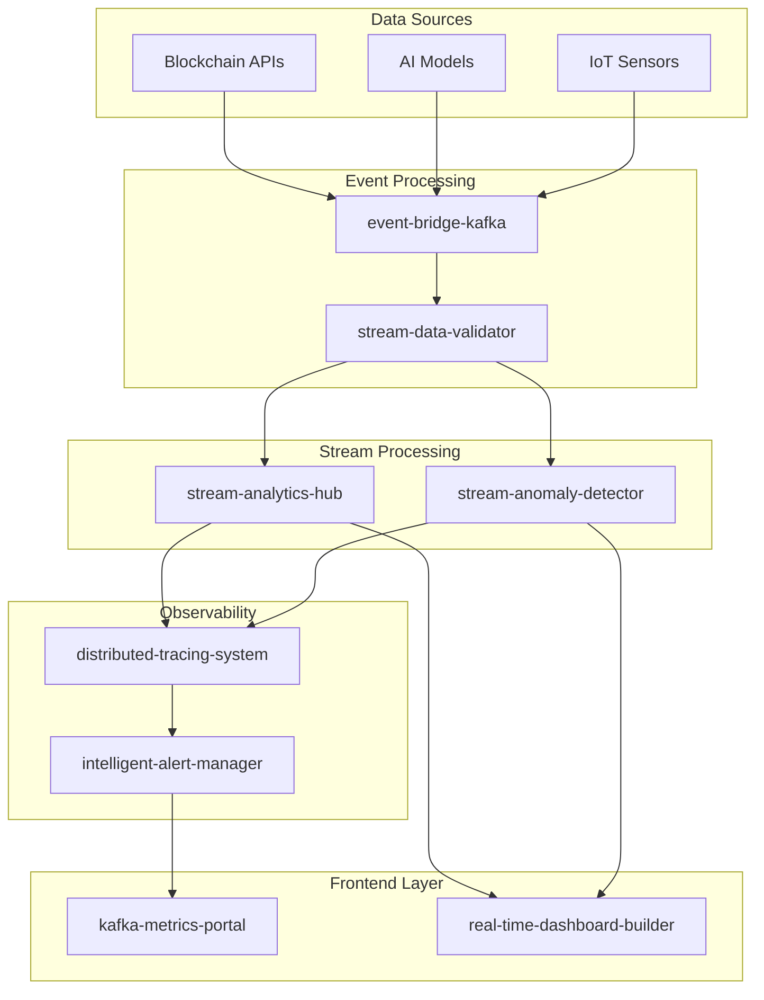

# 🚀 StreamForge - Ecosistema de Streaming y Analytics en Tiempo Real

> **Ecosistema completo de microservicios para procesamiento de streams, análisis de datos en tiempo real y observabilidad empresarial.**

## 📋 **Proyectos del Ecosistema**

### **Proyectos Base (5 existentes)**
1. **[event-bridge-kafka](./projects/event-bridge-kafka/)** - Gateway de eventos blockchain/IA
2. **[stream-anomaly-detector](./projects/stream-anomaly-detector/)** - ML en tiempo real
3. **[stream-analytics-hub](./projects/stream-analytics-hub/)** - KSQLDB + Flink
4. **[kafka-metrics-portal](./projects/kafka-metrics-portal/)** - UI de métricas
5. **[log-replay-simulator](./projects/log-replay-simulator/)** - Simulador de tráfico

### **Proyectos Nuevos (5 propuestos)**
6. **[distributed-tracing-system](./projects/distributed-tracing-system/)** - Trazabilidad distribuida
7. **[intelligent-alert-manager](./projects/intelligent-alert-manager/)** - Alertas inteligentes
8. **[real-time-dashboard-builder](./projects/real-time-dashboard-builder/)** - Constructor de dashboards
9. **[stream-data-validator](./projects/stream-data-validator/)** - Validador de datos
10. **[multi-tenant-isolation-engine](./projects/multi-tenant-isolation-engine/)** - Aislamiento multi-tenant

## 🛠️ **Stack Tecnológico**

### **Backend**
- **Go**: distributed-tracing-system, stream-data-validator, multi-tenant-isolation-engine
- **Python**: stream-anomaly-detector, intelligent-alert-manager
- **Node.js/NestJS**: event-bridge-kafka, kafka-metrics-portal
- **Java**: stream-analytics-hub

### **Frontend**
- **Angular**: Todos los proyectos frontend
- **React**: kafka-metrics-portal (existente)

### **Infraestructura**
- **Kafka**: Todos los proyectos
- **Docker**: Todos los proyectos
- **Kubernetes**: multi-tenant-isolation-engine
- **Prometheus + Grafana**: Observabilidad

## 🚀 **Inicio Rápido**

```bash
# Clonar el repositorio
git clone <repo-url>
cd sttream-forge

# Levantar todo el ecosistema
make up

# Ver logs
make logs

# Parar todo
make clean
```

## 📊 **Arquitectura del Ecosistema**



## 🎯 **Orden de Implementación**

### **Fase 1: Base (2-3 meses)**
1. event-bridge-kafka ✅
2. log-replay-simulator ✅
3. distributed-tracing-system 🆕

### **Fase 2: Core Analytics (2-3 meses)**
4. stream-analytics-hub ✅
5. stream-data-validator 🆕
6. kafka-metrics-portal ✅

### **Fase 3: Intelligence (2-3 meses)**
7. stream-anomaly-detector ✅
8. intelligent-alert-manager 🆕

### **Fase 4: User Experience (2-3 meses)**
9. real-time-dashboard-builder 🆕

### **Fase 5: Enterprise (2-3 meses)**
10. multi-tenant-isolation-engine 🆕

## 📁 **Estructura del Proyecto**

```
sttream-forge/
├── projects/                    # Todos los microservicios
├── docs/                       # Documentación
├── scripts/                    # Scripts de automatización
├── docker/                     # Configuración Docker
├── k8s/                       # Manifests Kubernetes
├── monitoring/                # Configuración Prometheus/Grafana
└── examples/                  # Ejemplos y demos
```

## 🔧 **Características Comunes**

- ✅ `/metrics` endpoint Prometheus-ready
- ✅ Dashboard JSON Grafana exportado
- ✅ CI/CD en GitHub Actions
- ✅ `make up` / `make clean`
- ✅ Docker Compose para desarrollo
- ✅ Health checks
- ✅ Logging estructurado
- ✅ Rate limiting
- ✅ Authentication/Authorization

## 📚 **Documentación**

- [Guía de Desarrollo](./docs/development.md)
- [Arquitectura](./docs/architecture.md)
- [Deployment](./docs/deployment.md)
- [API Reference](./docs/api-reference.md)

## 🤝 **Contribuir**

1. Fork el proyecto
2. Crea tu feature branch (`git checkout -b feature/AmazingFeature`)
3. Commit tus cambios (`git commit -m 'Add some AmazingFeature'`)
4. Push a la branch (`git push origin feature/AmazingFeature`)
5. Abre un Pull Request

## 📄 **Licencia**

Este proyecto está bajo la Licencia MIT - ver el archivo [LICENSE](LICENSE) para detalles.

## 🆘 **Soporte**

- 📧 Email: support@streamforge.dev
- 💬 Discord: [StreamForge Community](https://discord.gg/streamforge)
- 📖 Wiki: [Documentación Completa](https://wiki.streamforge.dev)

---

**Hecho con ❤️ por el equipo StreamForge**
