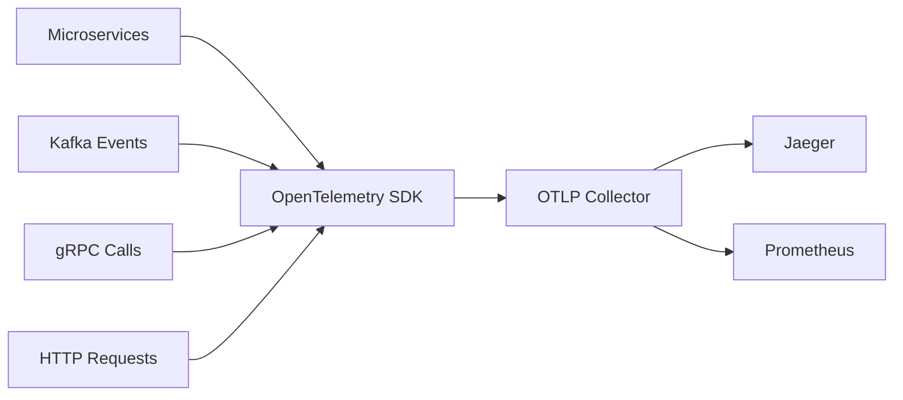

# 🔍 Distributed Tracing System

> **Sistema de tracing distribuido con OpenTelemetry.**

## 📋 **Descripción**

Distributed Tracing System proporciona trazabilidad completa de requests a través de todos los microservicios del ecosistema StreamForge. Utiliza OpenTelemetry para instrumentación automática y Jaeger para visualización.

## 🛠️ **Stack Tecnológico**

- **Backend**: Go + gRPC
- **Tracing**: OpenTelemetry + Jaeger
- **Streaming**: Kafka + Kafka Consumer
- **Observabilidad**: Prometheus + Grafana
- **Containerización**: Docker

## 🚀 **Características**

- ✅ Instrumentación automática de microservicios
- ✅ Correlación de traces entre servicios
- ✅ Dashboard de performance y bottlenecks
- ✅ Alertas automáticas por latencia
- ✅ Métricas de tracing en tiempo real
- ✅ Exportación a múltiples backends
- ✅ Sampling configurable

## 📊 **Arquitectura**



## 🔧 **Configuración**

### **Variables de Entorno**

```bash
# Jaeger
JAEGER_AGENT_HOST=jaeger
JAEGER_AGENT_PORT=14268
JAEGER_ENDPOINT=http://jaeger:14268/api/traces

# OpenTelemetry
OTEL_SERVICE_NAME=distributed-tracing-system
OTEL_EXPORTER_OTLP_ENDPOINT=http://jaeger:14268
OTEL_TRACES_EXPORTER=jaeger
OTEL_METRICS_EXPORTER=prometheus

# Kafka
KAFKA_BROKERS=localhost:9092
KAFKA_TOPIC_TRACES=trace-events
KAFKA_GROUP_ID=tracing-system

# Observabilidad
PROMETHEUS_PORT=9091
LOG_LEVEL=info
```

### **Endpoints de API**

```yaml
GET  /api/v1/traces/search        # Buscar traces
GET  /api/v1/traces/{traceId}      # Obtener trace específico
GET  /api/v1/services              # Listar servicios
GET  /api/v1/operations            # Listar operaciones
GET  /api/v1/metrics               # Métricas de tracing
GET  /api/v1/health                # Health check
```

## 🚀 **Inicio Rápido**

```bash
# Instalar dependencias
go mod download

# Configurar variables de entorno
cp .env.example .env

# Levantar en desarrollo
make up

# Ver logs
make logs
```

## 🔍 **Instrumentación Automática**

### **NestJS (event-bridge-kafka)**
```typescript
// Instrumentación automática
import { TraceService } from '@nestjs/opentelemetry';

@Injectable()
export class EventService {
  constructor(private traceService: TraceService) {}
  
  async processEvent(event: any) {
    const span = this.traceService.startSpan('process-event');
    try {
      // Lógica de procesamiento
      span.setAttributes({
        'event.type': event.type,
        'event.size': JSON.stringify(event).length
      });
    } finally {
      span.end();
    }
  }
}
```

### **FastAPI (stream-anomaly-detector)**
```python
# Instrumentación automática
from opentelemetry import trace
from opentelemetry.instrumentation.fastapi import FastAPIInstrumentor

tracer = trace.get_tracer(__name__)

@app.post("/detect")
async def detect_anomalies(data: dict):
    with tracer.start_as_current_span("detect-anomalies") as span:
        span.set_attribute("data.size", len(data))
        # Lógica de detección
        return result
```

### **Go (distributed-tracing-system)**
```go
// Instrumentación manual
import "go.opentelemetry.io/otel/trace"

func processTrace(ctx context.Context, data []byte) error {
    tracer := otel.Tracer("distributed-tracing-system")
    ctx, span := tracer.Start(ctx, "process-trace")
    defer span.End()
    
    span.SetAttributes(
        attribute.String("data.type", "trace"),
        attribute.Int("data.size", len(data)),
    )
    
    // Procesamiento
    return nil
}
```

## 📈 **Métricas de Tracing**

- `traces_received_total`
- `traces_processed_total`
- `trace_duration_seconds`
- `spans_per_trace`
- `trace_sampling_rate`
- `service_latency_p50/p90/p99`

## 🧪 **Testing**

```bash
# Tests unitarios
go test ./...

# Tests de integración
go test -tags=integration ./...

# Tests de performance
go test -bench=. ./...

# Coverage
go test -cover ./...
```

## 📚 **API Documentation**

### **Buscar Traces**

```bash
curl -X GET "http://localhost:8082/api/v1/traces/search?service=event-bridge-kafka&operation=process-event&limit=10"
```

### **Obtener Trace Específico**

```bash
curl -X GET "http://localhost:8082/api/v1/traces/1234567890abcdef"
```

### **Métricas de Servicio**

```bash
curl -X GET "http://localhost:8082/api/v1/metrics?service=event-bridge-kafka&metric=latency"
```

## 🔍 **Monitoreo**

### **Health Check**

```bash
curl http://localhost:8082/api/v1/health
```

### **Métricas**

```bash
curl http://localhost:8082/api/v1/metrics
```

### **Dashboard Jaeger**

Accede a Jaeger en: http://localhost:16686

## 🐳 **Docker**

```bash
# Construir imagen
docker build -t streamforge/distributed-tracing-system .

# Ejecutar contenedor
docker run -p 8082:8080 \
  -e JAEGER_AGENT_HOST=jaeger \
  -e KAFKA_BROKERS=localhost:9092 \
  streamforge/distributed-tracing-system
```

## 📁 **Estructura del Proyecto**

```
distributed-tracing-system/
├── src/
│   ├── api/              # gRPC API
│   ├── collectors/       # Collectors de traces
│   ├── exporters/        # Exporters a Jaeger
│   ├── processors/       # Procesadores de traces
│   └── utils/            # Utilidades
├── instrumentation/      # Instrumentación por lenguaje
│   ├── nestjs/          # NestJS
│   ├── fastapi/         # FastAPI
│   └── go/              # Go
├── tests/                # Tests
└── docker/              # Configuración Docker
```

## 🎯 **Casos de Uso**

### **Debugging**
- Identificar bottlenecks en microservicios
- Rastrear requests a través de múltiples servicios
- Analizar latencia y dependencias

### **Performance**
- Optimizar servicios lentos
- Identificar cuellos de botella
- Monitorear SLA de servicios

### **Observabilidad**
- Dashboard de salud del sistema
- Alertas por latencia alta
- Métricas de uso de servicios

## 🔧 **Configuración Avanzada**

### **Sampling**
```yaml
# Configuración de sampling
sampling:
  strategy: probabilistic
  rate: 0.1  # 10% de traces
  max_traces_per_second: 100
```

### **Exportación**
```yaml
# Configuración de exportación
exporters:
  jaeger:
    endpoint: http://jaeger:14268
    timeout: 30s
  prometheus:
    endpoint: http://prometheus:9090
    metrics_path: /metrics
```

## 🤝 **Contribuir**

1. Fork el proyecto
2. Crea tu feature branch (`git checkout -b feature/AmazingFeature`)
3. Commit tus cambios (`git commit -m 'Add some AmazingFeature'`)
4. Push a la branch (`git push origin feature/AmazingFeature`)
5. Abre un Pull Request

## 📄 **Licencia**

Este proyecto está bajo la Licencia MIT - ver el archivo [LICENSE](LICENSE) para detalles.

---

**Parte del ecosistema StreamForge** 🚀
