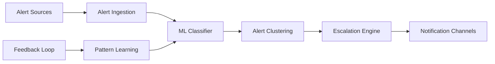

# 🚨 Intelligent Alert Manager

> **Sistema de alertas inteligentes con ML.**

## 📋 **Descripción**

Intelligent Alert Manager es un sistema avanzado de gestión de alertas que utiliza machine learning para reducir el alert fatigue, agrupar alertas similares y proporcionar escalación automática inteligente.

## 🛠️ **Stack Tecnológico**

- **Backend**: Python + FastAPI
- **ML**: TensorFlow + Scikit-learn
- **Caching**: Redis + Celery
- **Streaming**: Kafka + Kafka Consumer
- **Observabilidad**: Prometheus + Grafana
- **Containerización**: Docker

## 🚀 **Características**

- ✅ Clustering de alertas similares
- ✅ Predicción de alertas basada en patrones
- ✅ Escalación automática inteligente
- ✅ Integración con Slack/Discord/Teams
- ✅ Dashboard de gestión de alertas
- ✅ API REST para configuración
- ✅ Métricas de efectividad

## 📊 **Arquitectura**



## 🔧 **Configuración**

### **Variables de Entorno**

```bash
# Redis
REDIS_URL=redis://redis:6379
REDIS_DB=0

# Kafka
KAFKA_BROKERS=localhost:9092
KAFKA_TOPIC_ALERTS=alert-events
KAFKA_GROUP_ID=alert-manager

# Prometheus
PROMETHEUS_URL=http://prometheus:9090
PROMETHEUS_QUERY_TIMEOUT=30s

# Notificaciones
SLACK_WEBHOOK_URL=https://hooks.slack.com/...
DISCORD_WEBHOOK_URL=https://discord.com/api/webhooks/...
TEAMS_WEBHOOK_URL=https://outlook.office.com/webhook/...

# ML
MODEL_PATH=/app/models
RETRAIN_INTERVAL=3600
CLUSTERING_THRESHOLD=0.8
```

### **Endpoints de API**

```yaml
POST /api/v1/alerts                    # Crear alerta
GET  /api/v1/alerts                    # Listar alertas
GET  /api/v1/alerts/{id}               # Obtener alerta
POST /api/v1/alerts/{id}/acknowledge   # Reconocer alerta
POST /api/v1/alerts/{id}/resolve       # Resolver alerta
GET  /api/v1/clusters                  # Clusters de alertas
POST /api/v1/rules                     # Crear regla
GET  /api/v1/metrics                  # Métricas
GET  /api/v1/health                   # Health check
```

## 🚀 **Inicio Rápido**

```bash
# Instalar dependencias
pip install -r requirements.txt

# Configurar variables de entorno
cp .env.example .env

# Descargar modelos ML
make download-models

# Levantar en desarrollo
make up

# Ver logs
make logs
```

## 🤖 **Algoritmos ML**

### **1. Clustering de Alertas**
- **Algoritmo**: DBSCAN + K-Means
- **Propósito**: Agrupar alertas similares
- **Features**: Severidad, servicio, mensaje, timestamp

### **2. Predicción de Alertas**
- **Algoritmo**: LSTM + Random Forest
- **Propósito**: Predecir alertas futuras
- **Features**: Patrones históricos, métricas del sistema

### **3. Clasificación de Severidad**
- **Algoritmo**: Gradient Boosting
- **Propósito**: Clasificar automáticamente la severidad
- **Features**: Contenido del mensaje, contexto, historial

## 📈 **Métricas de Alertas**

- `alerts_received_total`
- `alerts_clustered_total`
- `alerts_resolved_total`
- `alert_resolution_time_seconds`
- `false_positive_rate`
- `alert_fatigue_score`

## 🧪 **Testing**

```bash
# Tests unitarios
pytest tests/unit/

# Tests de integración
pytest tests/integration/

# Tests de ML
pytest tests/ml/

# Coverage
pytest --cov=src tests/
```

## 📚 **API Documentation**

### **Crear Alerta**

```bash
curl -X POST http://localhost:8002/api/v1/alerts \
  -H "Content-Type: application/json" \
  -d '{
    "title": "High CPU Usage",
    "description": "CPU usage is above 90%",
    "severity": "warning",
    "service": "event-bridge-kafka",
    "labels": {
      "instance": "kafka-1",
      "environment": "production"
    }
  }'
```

### **Clustering de Alertas**

```bash
curl -X GET "http://localhost:8002/api/v1/clusters?service=event-bridge-kafka&limit=10"
```

### **Configurar Regla de Escalación**

```bash
curl -X POST http://localhost:8002/api/v1/rules \
  -H "Content-Type: application/json" \
  -d '{
    "name": "High CPU Escalation",
    "condition": "severity == \"critical\" AND service == \"event-bridge-kafka\"",
    "escalation": {
      "delay": 300,
      "channels": ["slack", "email"],
      "recipients": ["oncall@company.com"]
    }
  }'
```

## 🔍 **Monitoreo**

### **Health Check**

```bash
curl http://localhost:8002/api/v1/health
```

### **Métricas**

```bash
curl http://localhost:8002/api/v1/metrics
```

### **Dashboard Grafana**

El proyecto incluye dashboards pre-configurados para:
- Alertas activas por servicio
- Tendencias de alertas
- Efectividad del clustering
- Métricas de resolución

## 🐳 **Docker**

```bash
# Construir imagen
docker build -t streamforge/intelligent-alert-manager .

# Ejecutar contenedor
docker run -p 8002:8000 \
  -e REDIS_URL=redis://redis:6379 \
  -e KAFKA_BROKERS=localhost:9092 \
  -v $(pwd)/models:/app/models \
  streamforge/intelligent-alert-manager
```

## 📁 **Estructura del Proyecto**

```
intelligent-alert-manager/
├── src/
│   ├── api/              # FastAPI endpoints
│   ├── ml/               # Modelos ML
│   │   ├── clustering/   # Clustering algorithms
│   │   ├── prediction/   # Prediction models
│   │   └── classification/ # Classification models
│   ├── processors/        # Procesadores de alertas
│   ├── notifiers/        # Notificadores
│   └── utils/            # Utilidades
├── models/               # Modelos ML entrenados
├── data/                 # Datos de entrenamiento
├── tests/                # Tests
└── docker/              # Configuración Docker
```

## 🎯 **Casos de Uso**

### **Reducción de Alert Fatigue**
- Agrupar alertas similares
- Filtrar alertas irrelevantes
- Priorizar alertas críticas

### **Escalación Inteligente**
- Escalación automática basada en patrones
- Notificaciones contextuales
- Gestión de turnos de guardia

### **Análisis Predictivo**
- Predecir alertas futuras
- Identificar patrones de fallos
- Optimizar recursos de guardia

## 🔧 **Configuración Avanzada**

### **Clustering**
```yaml
# Configuración de clustering
clustering:
  algorithm: dbscan
  eps: 0.5
  min_samples: 2
  features: [severity, service, message_similarity, time_proximity]
```

### **Notificaciones**
```yaml
# Configuración de notificaciones
notifications:
  slack:
    webhook_url: ${SLACK_WEBHOOK_URL}
    channel: "#alerts"
    username: "AlertManager"
  email:
    smtp_host: smtp.gmail.com
    smtp_port: 587
    username: ${EMAIL_USER}
    password: ${EMAIL_PASSWORD}
```

## 🤝 **Contribuir**

1. Fork el proyecto
2. Crea tu feature branch (`git checkout -b feature/AmazingFeature`)
3. Commit tus cambios (`git commit -m 'Add some AmazingFeature'`)
4. Push a la branch (`git push origin feature/AmazingFeature`)
5. Abre un Pull Request

## 📄 **Licencia**

Este proyecto está bajo la Licencia MIT - ver el archivo [LICENSE](LICENSE) para detalles.

---

**Parte del ecosistema StreamForge** 🚀
