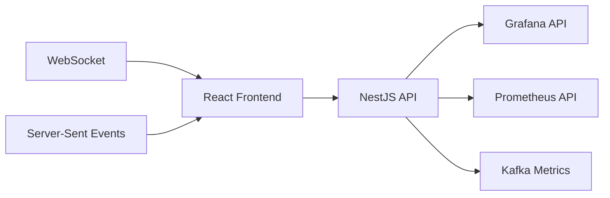

# 📈 Kafka Metrics Portal

> **UI consolidada de métricas en tiempo real.**

## 📋 **Descripción**

Kafka Metrics Portal es la interfaz de usuario principal del ecosistema StreamForge. Proporciona una vista consolidada de todas las métricas, dashboards interactivos y herramientas de monitoreo en tiempo real.

## 🛠️ **Stack Tecnológico**

- **Frontend**: React + TypeScript
- **Backend**: NestJS + TypeScript
- **Visualización**: Grafana API + Prometheus
- **Real-time**: WebSocket + Server-Sent Events
- **Containerización**: Docker

## 🚀 **Características**

- ✅ Dashboard unificado de métricas
- ✅ Visualizaciones en tiempo real
- ✅ Alertas y notificaciones
- ✅ Exportación de reportes
- ✅ Configuración de dashboards
- ✅ Multi-tenant support
- ✅ API REST completa

## 📊 **Arquitectura**



## 🔧 **Configuración**

### **Variables de Entorno**

```bash
# Backend
PORT=3000
NODE_ENV=development

# Grafana
GRAFANA_URL=http://grafana:3000
GRAFANA_USER=admin
GRAFANA_PASSWORD=admin123

# Prometheus
PROMETHEUS_URL=http://prometheus:9090

# Kafka
KAFKA_BROKERS=localhost:9092
KAFKA_TOPIC_METRICS=metrics-events

# Real-time
WEBSOCKET_PORT=3001
SSE_ENABLED=true
```

### **Endpoints de API**

```yaml
GET  /api/v1/metrics/summary      # Resumen de métricas
GET  /api/v1/metrics/realtime     # Métricas en tiempo real
GET  /api/v1/dashboards           # Listar dashboards
POST /api/v1/dashboards           # Crear dashboard
GET  /api/v1/alerts                # Alertas activas
POST /api/v1/alerts                # Crear alerta
GET  /api/v1/health                # Health check
```

## 🚀 **Inicio Rápido**

```bash
# Instalar dependencias
npm install

# Configurar variables de entorno
cp .env.example .env

# Levantar en desarrollo
make up

# Ver logs
make logs
```

## 📈 **Dashboards Disponibles**

### **Overview Dashboard**
- Métricas generales del sistema
- Estado de servicios
- Alertas activas
- Tendencias principales

### **Kafka Dashboard**
- Throughput de mensajes
- Lag de consumidores
- Particiones y replicas
- Performance de brokers

### **ML Dashboard**
- Accuracy de modelos
- Latencia de predicciones
- Detección de anomalías
- Métricas de entrenamiento

### **Analytics Dashboard**
- KPIs en tiempo real
- Agregaciones por período
- Tendencias y patrones
- Comparativas históricas

## 🧪 **Testing**

```bash
# Tests unitarios
npm run test

# Tests de integración
npm run test:integration

# Tests E2E
npm run test:e2e

# Coverage
npm run test:coverage
```

## 📚 **API Documentation**

### **Obtener Métricas en Tiempo Real**

```bash
curl -X GET "http://localhost:3002/api/v1/metrics/realtime?services=event-bridge,anomaly-detector"
```

### **Crear Dashboard**

```bash
curl -X POST http://localhost:3002/api/v1/dashboards \
  -H "Content-Type: application/json" \
  -d '{
    "name": "My Dashboard",
    "description": "Custom dashboard",
    "panels": [
      {
        "title": "Transactions per Second",
        "query": "rate(transactions_total[5m])",
        "type": "graph"
      }
    ]
  }'
```

### **WebSocket Connection**

```javascript
const ws = new WebSocket('ws://localhost:3002/ws/metrics');
ws.onmessage = (event) => {
  const data = JSON.parse(event.data);
  console.log('Real-time metrics:', data);
};
```

## 🔍 **Monitoreo**

### **Health Check**

```bash
curl http://localhost:3002/api/v1/health
```

### **Métricas**

```bash
curl http://localhost:3002/api/v1/metrics
```

## 🐳 **Docker**

```bash
# Construir imagen
docker build -t streamforge/kafka-metrics-portal .

# Ejecutar contenedor
docker run -p 3002:3000 \
  -e GRAFANA_URL=http://grafana:3000 \
  -e PROMETHEUS_URL=http://prometheus:9090 \
  streamforge/kafka-metrics-portal
```

## 📁 **Estructura del Proyecto**

```
kafka-metrics-portal/
├── src/
│   ├── frontend/          # React app
│   │   ├── components/    # React components
│   │   ├── pages/         # Páginas
│   │   ├── hooks/         # Custom hooks
│   │   └── utils/         # Utilidades
│   ├── backend/           # NestJS API
│   │   ├── controllers/   # Controllers
│   │   ├── services/      # Services
│   │   ├── entities/      # Entities
│   │   └── dto/          # DTOs
├── public/               # Assets estáticos
├── tests/                # Tests
└── docker/               # Configuración Docker
```

## 🎯 **Características Avanzadas**

### **Real-time Updates**
- WebSocket para métricas en tiempo real
- Server-Sent Events para notificaciones
- Auto-refresh de dashboards

### **Custom Dashboards**
- Drag-and-drop interface
- Widgets personalizables
- Templates predefinidos
- Exportación a PDF/PNG

### **Alerting**
- Configuración de umbrales
- Notificaciones por email/Slack
- Escalación automática
- Historial de alertas

## 🔧 **Configuración de Grafana**

El portal se integra automáticamente con Grafana para:
- Importar dashboards existentes
- Crear nuevos dashboards
- Configurar alertas
- Gestionar usuarios y permisos

## 🤝 **Contribuir**

1. Fork el proyecto
2. Crea tu feature branch (`git checkout -b feature/AmazingFeature`)
3. Commit tus cambios (`git commit -m 'Add some AmazingFeature'`)
4. Push a la branch (`git push origin feature/AmazingFeature`)
5. Abre un Pull Request

## 📄 **Licencia**

Este proyecto está bajo la Licencia MIT - ver el archivo [LICENSE](LICENSE) para detalles.

---

**Parte del ecosistema StreamForge** 🚀
