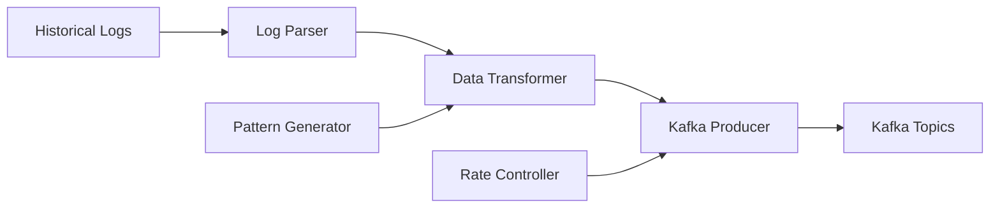

# 🔄 Log Replay Simulator

> **Reproduce logs históricos para simular tráfico.**

## 📋 **Descripción**

Log Replay Simulator es una herramienta que reproduce logs históricos para simular tráfico real en el ecosistema StreamForge. Perfecto para testing, demos y pruebas de carga.

## 🛠️ **Stack Tecnológico**

- **Backend**: Python + FastAPI
- **Streaming**: Kafka Producer
- **Data Processing**: Pandas + NumPy
- **Containerización**: Docker
- **Testing**: Pytest

## 🚀 **Características**

- ✅ Reproducción de logs históricos
- ✅ Simulación de múltiples fuentes de datos
- ✅ Control de velocidad de reproducción
- ✅ Generación de datos sintéticos
- ✅ Patrones de tráfico configurables
- ✅ Métricas de simulación
- ✅ API REST para control

## 📊 **Arquitectura**



## 🔧 **Configuración**

### **Variables de Entorno**

```bash
# Kafka
KAFKA_BROKERS=localhost:9092
KAFKA_TOPIC_EVENTS=blockchain-events
KAFKA_TOPIC_AI=ai-events
KAFKA_TOPIC_IOT=iot-events

# Simulación
REPLAY_SPEED=1.0              # 1.0 = tiempo real, 2.0 = 2x velocidad
BATCH_SIZE=100
MAX_EVENTS=10000
PATTERN_TYPE=blockchain       # blockchain, ai, iot, mixed

# API
PORT=5000
LOG_LEVEL=info
```

### **Endpoints de API**

```yaml
POST /api/v1/simulate/start     # Iniciar simulación
POST /api/v1/simulate/stop      # Parar simulación
POST /api/v1/simulate/pause     # Pausar simulación
GET  /api/v1/simulate/status    # Estado de simulación
POST /api/v1/patterns/generate  # Generar patrón
GET  /api/v1/metrics            # Métricas
GET  /api/v1/health             # Health check
```

## 🚀 **Inicio Rápido**

```bash
# Instalar dependencias
pip install -r requirements.txt

# Configurar variables de entorno
cp .env.example .env

# Preparar datos de ejemplo
make prepare-sample-data

# Levantar en desarrollo
make up

# Ver logs
make logs
```

## 📊 **Tipos de Simulación**

### **Blockchain Events**
```python
# Ejemplo de evento blockchain
{
    "blockNumber": 12345,
    "transactionHash": "0x...",
    "from": "0x...",
    "to": "0x...",
    "value": "1000000000000000000",
    "gasPrice": "20000000000",
    "timestamp": 1640995200
}
```

### **AI Events**
```python
# Ejemplo de evento IA
{
    "modelId": "gpt-4",
    "input": "Hello world",
    "output": "Hello! How can I help you?",
    "confidence": 0.95,
    "processingTime": 1.2,
    "timestamp": 1640995200
}
```

### **IoT Events**
```python
# Ejemplo de evento IoT
{
    "deviceId": "sensor-001",
    "sensorType": "temperature",
    "value": 23.5,
    "unit": "celsius",
    "location": "room-101",
    "timestamp": 1640995200
}
```

## 🧪 **Testing**

```bash
# Tests unitarios
pytest tests/unit/

# Tests de integración
pytest tests/integration/

# Tests de performance
pytest tests/performance/

# Coverage
pytest --cov=src tests/
```

## 📚 **API Documentation**

### **Iniciar Simulación**

```bash
curl -X POST http://localhost:5001/api/v1/simulate/start \
  -H "Content-Type: application/json" \
  -d '{
    "pattern": "blockchain",
    "speed": 2.0,
    "maxEvents": 1000,
    "startTime": "2024-01-01T00:00:00Z"
  }'
```

### **Generar Patrón Personalizado**

```bash
curl -X POST http://localhost:5001/api/v1/patterns/generate \
  -H "Content-Type: application/json" \
  -d '{
    "type": "blockchain",
    "duration": "1h",
    "eventsPerSecond": 10,
    "variations": {
      "transactionTypes": ["transfer", "swap", "mint"],
      "valueRange": [0.001, 100.0],
      "gasPriceRange": [20000000000, 50000000000]
    }
  }'
```

### **Estado de Simulación**

```bash
curl -X GET http://localhost:5001/api/v1/simulate/status
```

## 🔍 **Monitoreo**

### **Health Check**

```bash
curl http://localhost:5001/api/v1/health
```

### **Métricas**

```bash
curl http://localhost:5001/api/v1/metrics
```

## 🐳 **Docker**

```bash
# Construir imagen
docker build -t streamforge/log-replay-simulator .

# Ejecutar contenedor
docker run -p 5001:5000 \
  -e KAFKA_BROKERS=localhost:9092 \
  -v $(pwd)/data:/app/data \
  streamforge/log-replay-simulator
```

## 📁 **Estructura del Proyecto**

```
log-replay-simulator/
├── src/
│   ├── api/              # FastAPI endpoints
│   ├── simulators/       # Simuladores específicos
│   ├── parsers/          # Parsers de logs
│   ├── generators/       # Generadores de datos
│   └── utils/            # Utilidades
├── data/                 # Datos de ejemplo
│   ├── blockchain/       # Logs blockchain
│   ├── ai/              # Logs IA
│   └── iot/             # Logs IoT
├── patterns/            # Patrones de simulación
├── tests/               # Tests
└── docker/              # Configuración Docker
```

## 🎯 **Casos de Uso**

### **Testing**
- Simular tráfico real para tests
- Probar escalabilidad del sistema
- Validar comportamiento bajo carga

### **Demos**
- Mostrar capacidades del sistema
- Simular escenarios específicos
- Generar datos de ejemplo

### **Desarrollo**
- Probar nuevas funcionalidades
- Simular condiciones de producción
- Validar integraciones

## 🔧 **Configuración Avanzada**

### **Patrones de Tráfico**
```yaml
# Configuración de patrón blockchain
blockchain:
  baseRate: 10              # eventos por segundo
  peakRate: 100             # pico máximo
  peakDuration: 300         # duración del pico (segundos)
  variations:
    transactionTypes: [transfer, swap, mint, burn]
    valueDistribution: lognormal
    gasPriceRange: [20000000000, 50000000000]
```

### **Control de Velocidad**
```python
# Ejemplos de velocidad
speed = 1.0    # Tiempo real
speed = 2.0    # 2x velocidad
speed = 0.5    # 0.5x velocidad (más lento)
speed = 0      # Instantáneo
```

## 🤝 **Contribuir**

1. Fork el proyecto
2. Crea tu feature branch (`git checkout -b feature/AmazingFeature`)
3. Commit tus cambios (`git commit -m 'Add some AmazingFeature'`)
4. Push a la branch (`git push origin feature/AmazingFeature`)
5. Abre un Pull Request

## 📄 **Licencia**

Este proyecto está bajo la Licencia MIT - ver el archivo [LICENSE](LICENSE) para detalles.

---

**Parte del ecosistema StreamForge** 🚀
