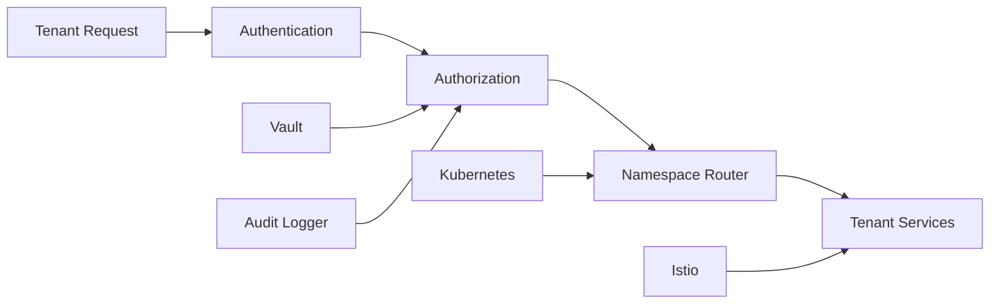

# 🏢 Multi-tenant Isolation Engine

> **Motor de aislamiento multi-tenant.**

## 📋 **Descripción**

Multi-tenant Isolation Engine proporciona aislamiento completo entre tenants en el ecosistema StreamForge. Incluye namespace isolation, network policies, secret management y resource quotas dinámicas.

## 🛠️ **Stack Tecnológico**

- **Backend**: Go + gRPC
- **Orchestration**: Kubernetes + Istio
- **Security**: Vault + JWT
- **Streaming**: Kafka + Kafka Consumer
- **Observabilidad**: Prometheus + Grafana
- **Containerización**: Docker

## 🚀 **Características**

- ✅ Namespace isolation por tenant
- ✅ Network policies automáticas
- ✅ Secret management por tenant
- ✅ Resource quotas dinámicas
- ✅ Audit logging completo
- ✅ API REST para gestión
- ✅ Dashboard de tenants

## 📊 **Arquitectura**



## 🔧 **Configuración**

### **Variables de Entorno**

```bash
# Kubernetes
KUBECONFIG=/path/to/kubeconfig
KUBERNETES_NAMESPACE_PREFIX=tenant-
KUBERNETES_RESOURCE_QUOTA_DEFAULT=1Gi

# Istio
ISTIO_GATEWAY=tenant-gateway
ISTIO_VIRTUAL_SERVICE=tenant-vs
ISTIO_DESTINATION_RULE=tenant-dr

# Vault
VAULT_ADDR=http://vault:8200
VAULT_TOKEN=your-vault-token
VAULT_SECRET_PATH=secret/tenants

# Kafka
KAFKA_BROKERS=localhost:9092
KAFKA_TOPIC_TENANTS=tenant-events
KAFKA_GROUP_ID=isolation-engine

# Observabilidad
PROMETHEUS_PORT=9091
LOG_LEVEL=info
```

### **Endpoints de API**

```yaml
POST /api/v1/tenants                    # Crear tenant
GET  /api/v1/tenants                   # Listar tenants
GET  /api/v1/tenants/{id}             # Obtener tenant
PUT  /api/v1/tenants/{id}             # Actualizar tenant
DELETE /api/v1/tenants/{id}           # Eliminar tenant
POST /api/v1/tenants/{id}/secrets     # Crear secret
GET  /api/v1/tenants/{id}/resources  # Recursos del tenant
GET  /api/v1/tenants/{id}/audit       # Audit log
GET  /api/v1/health                   # Health check
```

## 🚀 **Inicio Rápido**

```bash
# Instalar dependencias
go mod download

# Configurar variables de entorno
cp .env.example .env

# Configurar Kubernetes
make setup-k8s

# Levantar en desarrollo
make up

# Ver logs
make logs
```

## 🏢 **Gestión de Tenants**

### **Crear Tenant**
```bash
curl -X POST http://localhost:8084/api/v1/tenants \
  -H "Content-Type: application/json" \
  -H "Authorization: Bearer YOUR_TOKEN" \
  -d '{
    "name": "acme-corp",
    "displayName": "ACME Corporation",
    "plan": "enterprise",
    "resources": {
      "cpu": "2",
      "memory": "4Gi",
      "storage": "10Gi"
    },
    "features": ["analytics", "ml", "iot"]
  }'
```

### **Configurar Secrets**
```bash
curl -X POST http://localhost:8084/api/v1/tenants/acme-corp/secrets \
  -H "Content-Type: application/json" \
  -H "Authorization: Bearer YOUR_TOKEN" \
  -d '{
    "name": "database-credentials",
    "data": {
      "username": "acme_user",
      "password": "secure_password",
      "host": "acme-db.internal"
    }
  }'
```

### **Audit Log**
```bash
curl -X GET "http://localhost:8084/api/v1/tenants/acme-corp/audit?limit=10"
```

## 📈 **Métricas de Tenants**

- `tenant_requests_total`
- `tenant_resources_usage_cpu`
- `tenant_resources_usage_memory`
- `tenant_secrets_created_total`
- `tenant_audit_events_total`
- `tenant_isolation_violations_total`

## 🧪 **Testing**

```bash
# Tests unitarios
go test ./...

# Tests de integración
go test -tags=integration ./...

# Tests de seguridad
go test -tags=security ./...

# Coverage
go test -cover ./...
```

## 📚 **API Documentation**

### **Listar Tenants**

```bash
curl -X GET "http://localhost:8084/api/v1/tenants?limit=10&offset=0"
```

### **Obtener Recursos del Tenant**

```bash
curl -X GET "http://localhost:8084/api/v1/tenants/acme-corp/resources"
```

### **Crear Network Policy**

```bash
curl -X POST http://localhost:8084/api/v1/tenants/acme-corp/network-policies \
  -H "Content-Type: application/json" \
  -d '{
    "name": "acme-isolation",
    "rules": [
      {
        "direction": "ingress",
        "from": [{"namespaceSelector": {"matchLabels": {"tenant": "acme-corp"}}}],
        "ports": [{"protocol": "TCP", "port": 8080}]
      }
    ]
  }'
```

## 🔍 **Monitoreo**

### **Health Check**

```bash
curl http://localhost:8084/api/v1/health
```

### **Métricas**

```bash
curl http://localhost:8084/api/v1/metrics
```

### **Dashboard Grafana**

El proyecto incluye dashboards pre-configurados para:
- Uso de recursos por tenant
- Violaciones de aislamiento
- Audit logs en tiempo real
- Performance de tenants

## 🐳 **Docker**

```bash
# Construir imagen
docker build -t streamforge/multi-tenant-isolation-engine .

# Ejecutar contenedor
docker run -p 8084:8080 \
  -e KUBECONFIG=/path/to/kubeconfig \
  -e VAULT_ADDR=http://vault:8200 \
  -v /path/to/kubeconfig:/kubeconfig \
  streamforge/multi-tenant-isolation-engine
```

## 📁 **Estructura del Proyecto**

```
multi-tenant-isolation-engine/
├── src/
│   ├── api/              # gRPC API
│   ├── tenants/          # Gestión de tenants
│   ├── isolation/       # Lógica de aislamiento
│   ├── security/         # Seguridad y autenticación
│   ├── audit/           # Audit logging
│   └── utils/            # Utilidades
├── k8s/                 # Manifests Kubernetes
├── istio/               # Configuración Istio
├── vault/               # Configuración Vault
├── tests/                # Tests
└── docker/              # Configuración Docker
```

## 🎯 **Características de Aislamiento**

### **Namespace Isolation**
```yaml
# Cada tenant tiene su propio namespace
apiVersion: v1
kind: Namespace
metadata:
  name: tenant-acme-corp
  labels:
    tenant: acme-corp
    isolation: enabled
```

### **Network Policies**
```yaml
# Políticas de red por tenant
apiVersion: networking.k8s.io/v1
kind: NetworkPolicy
metadata:
  name: tenant-acme-corp-isolation
spec:
  podSelector:
    matchLabels:
      tenant: acme-corp
  policyTypes:
  - Ingress
  - Egress
  ingress:
  - from:
    - namespaceSelector:
        matchLabels:
          tenant: acme-corp
```

### **Resource Quotas**
```yaml
# Cuotas de recursos por tenant
apiVersion: v1
kind: ResourceQuota
metadata:
  name: tenant-acme-corp-quota
spec:
  hard:
    requests.cpu: "2"
    requests.memory: 4Gi
    limits.cpu: "4"
    limits.memory: 8Gi
    persistentvolumeclaims: "10"
```

## 🔧 **Configuración Avanzada**

### **Istio Configuration**
```yaml
# Virtual Service por tenant
apiVersion: networking.istio.io/v1alpha3
kind: VirtualService
metadata:
  name: tenant-acme-corp-vs
spec:
  hosts:
  - acme-corp.streamforge.dev
  http:
  - match:
    - headers:
        tenant:
          exact: acme-corp
    route:
    - destination:
        host: tenant-acme-corp-service
```

### **Vault Integration**
```yaml
# Configuración de Vault
vault:
  address: http://vault:8200
  token: ${VAULT_TOKEN}
  secrets:
    path: secret/tenants
    policies:
      - tenant-read
      - tenant-write
```

## 🤝 **Contribuir**

1. Fork el proyecto
2. Crea tu feature branch (`git checkout -b feature/AmazingFeature`)
3. Commit tus cambios (`git commit -m 'Add some AmazingFeature'`)
4. Push a la branch (`git push origin feature/AmazingFeature`)
5. Abre un Pull Request

## 📄 **Licencia**

Este proyecto está bajo la Licencia MIT - ver el archivo [LICENSE](LICENSE) para detalles.

---

**Parte del ecosistema StreamForge** 🚀
