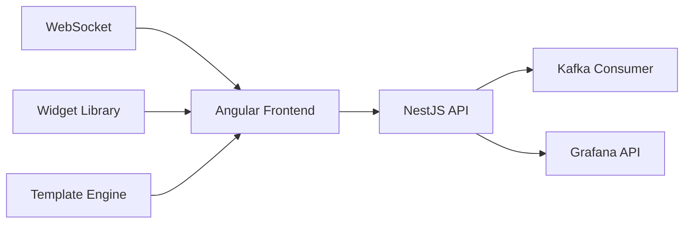

# 🎨 Real-time Dashboard Builder

> **Constructor de dashboards drag-and-drop.**

## 📋 **Descripción**

Real-time Dashboard Builder es una herramienta visual que permite crear dashboards personalizados sin código. Incluye editor drag-and-drop, widgets personalizables y visualizaciones en tiempo real.

## 🛠️ **Stack Tecnológico**

- **Frontend**: Angular + TypeScript
- **Backend**: NestJS + TypeScript
- **Visualización**: D3.js + Chart.js + ngx-charts
- **Real-time**: WebSocket + Server-Sent Events
- **Streaming**: Kafka + Kafka Consumer
- **Containerización**: Docker

## 🚀 **Características**

- ✅ Editor visual drag-and-drop
- ✅ Widgets personalizables (gráficos, tablas, KPIs)
- ✅ Tiempo real con WebSockets
- ✅ Export a PDF/PNG
- ✅ Templates predefinidos
- ✅ Multi-tenant support
- ✅ API REST completa

## 📊 **Arquitectura**



## 🔧 **Configuración**

### **Variables de Entorno**

```bash
# Backend
PORT=3000
NODE_ENV=development

# Kafka
KAFKA_BROKERS=localhost:9092
KAFKA_TOPIC_METRICS=metrics-events
KAFKA_GROUP_ID=dashboard-builder

# Grafana
GRAFANA_URL=http://grafana:3000
GRAFANA_USER=admin
GRAFANA_PASSWORD=admin123

# Real-time
WEBSOCKET_PORT=3001
SSE_ENABLED=true

# Export
EXPORT_PATH=/app/exports
MAX_EXPORT_SIZE=50MB
```

### **Endpoints de API**

```yaml
GET  /api/v1/dashboards              # Listar dashboards
POST /api/v1/dashboards              # Crear dashboard
GET  /api/v1/dashboards/{id}         # Obtener dashboard
PUT  /api/v1/dashboards/{id}         # Actualizar dashboard
DELETE /api/v1/dashboards/{id}       # Eliminar dashboard
GET  /api/v1/widgets                 # Listar widgets
POST /api/v1/dashboards/{id}/export  # Exportar dashboard
GET  /api/v1/templates               # Listar templates
GET  /api/v1/health                  # Health check
```

## 🚀 **Inicio Rápido**

```bash
# Instalar dependencias
npm install

# Configurar variables de entorno
cp .env.example .env

# Levantar en desarrollo
make up

# Ver logs
make logs
```

## 🎨 **Widgets Disponibles**

### **Gráficos**
- **Line Chart**: Tendencias temporales
- **Bar Chart**: Comparaciones
- **Pie Chart**: Distribuciones
- **Area Chart**: Volúmenes acumulados
- **Scatter Plot**: Correlaciones

### **Tablas**
- **Data Table**: Datos tabulares
- **Heatmap**: Matrices de datos
- **Pivot Table**: Agregaciones dinámicas

### **KPIs**
- **Single Stat**: Métrica única
- **Gauge**: Medidores
- **Progress Bar**: Progreso
- **Counter**: Contadores

### **Especializados**
- **Map**: Visualizaciones geográficas
- **Timeline**: Líneas de tiempo
- **Tree**: Estructuras jerárquicas
- **Network**: Grafos de relaciones

## 🧪 **Testing**

```bash
# Tests unitarios
npm run test

# Tests de integración
npm run test:integration

# Tests E2E
npm run test:e2e

# Coverage
npm run test:coverage
```

## 📚 **API Documentation**

### **Crear Dashboard**

```bash
curl -X POST http://localhost:4200/api/v1/dashboards \
  -H "Content-Type: application/json" \
  -d '{
    "name": "My Dashboard",
    "description": "Custom dashboard",
    "panels": [
      {
        "id": "panel-1",
        "type": "line-chart",
        "title": "Transactions per Second",
        "query": "rate(transactions_total[5m])",
        "position": { "x": 0, "y": 0, "w": 12, "h": 8 }
      }
    ]
  }'
```

### **Exportar Dashboard**

```bash
curl -X GET "http://localhost:4200/api/v1/dashboards/123/export?format=pdf"
```

### **WebSocket Connection**

```typescript
// Conexión WebSocket para datos en tiempo real
const ws = new WebSocket('ws://localhost:4200/ws/dashboard/123');
ws.onmessage = (event) => {
  const data = JSON.parse(event.data);
  console.log('Real-time data:', data);
};
```

## 🔍 **Monitoreo**

### **Health Check**

```bash
curl http://localhost:4200/api/v1/health
```

### **Métricas**

```bash
curl http://localhost:4200/api/v1/metrics
```

## 🐳 **Docker**

```bash
# Construir imagen
docker build -t streamforge/real-time-dashboard-builder .

# Ejecutar contenedor
docker run -p 4200:4200 \
  -e KAFKA_BROKERS=localhost:9092 \
  -e GRAFANA_URL=http://grafana:3000 \
  streamforge/real-time-dashboard-builder
```

## 📁 **Estructura del Proyecto**

```
real-time-dashboard-builder/
├── src/
│   ├── app/
│   │   ├── core/           # Services, guards, interceptors
│   │   ├── shared/         # Components, pipes, directives
│   │   ├── features/        # Feature modules
│   │   │   ├── dashboard/  # Dashboard management
│   │   │   ├── widgets/    # Widget library
│   │   │   ├── templates/  # Template management
│   │   │   └── export/     # Export functionality
│   │   └── shell/          # Main layout
│   ├── assets/            # Static assets
│   └── environments/      # Environment configs
├── backend/              # NestJS API
├── tests/                # Tests
└── docker/               # Configuración Docker
```

## 🎯 **Características Avanzadas**

### **Editor Drag-and-Drop**
```typescript
// Ejemplo de configuración de widget
interface WidgetConfig {
  id: string;
  type: 'line-chart' | 'bar-chart' | 'table' | 'kpi';
  title: string;
  query: string;
  position: {
    x: number;
    y: number;
    w: number;
    h: number;
  };
  options: {
    colors?: string[];
    legend?: boolean;
    grid?: boolean;
    tooltip?: boolean;
  };
}
```

### **Templates Predefinidos**
- **Blockchain Analytics**: Dashboards para cripto
- **ML Monitoring**: Dashboards para modelos ML
- **IoT Dashboard**: Dashboards para sensores
- **Business KPIs**: Dashboards de negocio

### **Exportación**
- **PDF**: Reportes estáticos
- **PNG**: Imágenes de alta calidad
- **JSON**: Configuración de dashboard
- **CSV**: Datos tabulares

## 🔧 **Configuración Avanzada**

### **Widgets Personalizados**
```typescript
// Crear widget personalizado
@Component({
  selector: 'app-custom-widget',
  template: `
    <div class="custom-widget">
      <h3>{{ config.title }}</h3>
      <div [innerHTML]="renderedContent"></div>
    </div>
  `
})
export class CustomWidgetComponent {
  @Input() config: WidgetConfig;
  @Input() data: any[];
  
  get renderedContent() {
    // Lógica de renderizado personalizada
    return this.processData(this.data);
  }
}
```

### **Real-time Updates**
```typescript
// Servicio para actualizaciones en tiempo real
@Injectable()
export class RealtimeService {
  private ws$ = new WebSocketSubject<any>(this.wsUrl);
  
  getDashboardData(dashboardId: string) {
    return this.ws$.pipe(
      filter(data => data.dashboardId === dashboardId),
      map(data => data.payload)
    );
  }
}
```

## 🤝 **Contribuir**

1. Fork el proyecto
2. Crea tu feature branch (`git checkout -b feature/AmazingFeature`)
3. Commit tus cambios (`git commit -m 'Add some AmazingFeature'`)
4. Push a la branch (`git push origin feature/AmazingFeature`)
5. Abre un Pull Request

## 📄 **Licencia**

Este proyecto está bajo la Licencia MIT - ver el archivo [LICENSE](LICENSE) para detalles.

---

**Parte del ecosistema StreamForge** 🚀
