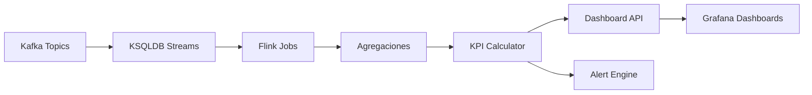

# 📊 Stream Analytics Hub

> **KSQLDB + Flink para agregaciones, dashboards de KPIs.**

## 📋 **Descripción**

Stream Analytics Hub es el centro de procesamiento de streams del ecosistema StreamForge. Utiliza KSQLDB y Apache Flink para realizar agregaciones en tiempo real, calcular KPIs y generar insights de negocio.

## 🛠️ **Stack Tecnológico**

- **Stream Processing**: KSQLDB + Apache Flink
- **Backend**: Java + Spring Boot
- **Streaming**: Kafka + Kafka Streams
- **Observabilidad**: Prometheus + Grafana
- **Containerización**: Docker

## 🚀 **Características**

- ✅ Agregaciones en tiempo real (sum, count, avg, min, max)
- ✅ Ventanas deslizantes y de tiempo
- ✅ Cálculo de KPIs automático
- ✅ Dashboards interactivos
- ✅ Alertas basadas en umbrales
- ✅ Exportación de datos a múltiples formatos
- ✅ API REST para consultas

## 📊 **Arquitectura**



## 🔧 **Configuración**

### **Variables de Entorno**

```bash
# Kafka
KAFKA_BROKERS=localhost:9092
KAFKA_TOPIC_INPUT=blockchain-events
KAFKA_TOPIC_OUTPUT=analytics-results

# KSQLDB
KSQLDB_SERVER=http://ksqldb:8088
KSQLDB_QUERY_TIMEOUT=30000

# Flink
FLINK_JOBMANAGER_RPC_ADDRESS=flink-jobmanager
FLINK_TASKMANAGER_NUMBEROFTASKSLOTS=4

# Observabilidad
PROMETHEUS_PORT=9091
LOG_LEVEL=info
```

### **Endpoints de API**

```yaml
GET  /api/v1/analytics/summary     # Resumen de KPIs
GET  /api/v1/analytics/trends      # Tendencias temporales
GET  /api/v1/analytics/alerts      # Alertas activas
POST /api/v1/analytics/query       # Consultas personalizadas
GET  /api/v1/metrics               # Métricas
GET  /api/v1/health                # Health check
```

## 🚀 **Inicio Rápido**

```bash
# Instalar dependencias
mvn clean install

# Configurar variables de entorno
cp .env.example .env

# Levantar en desarrollo
make up

# Ver logs
make logs
```

## 📈 **KPIs Disponibles**

### **Blockchain Analytics**
- **Transacciones por minuto/hora/día**
- **Volumen total por período**
- **Top wallets por actividad**
- **Gas price trends**
- **Network congestion metrics**

### **AI/ML Analytics**
- **Model accuracy trends**
- **Prediction confidence scores**
- **Processing latency metrics**
- **Error rates by model**

### **IoT Analytics**
- **Sensor data aggregation**
- **Device health metrics**
- **Environmental trends**
- **Anomaly detection rates**

## 🧪 **Testing**

```bash
# Tests unitarios
mvn test

# Tests de integración
mvn test -Dtest=IntegrationTest

# Tests de performance
mvn test -Dtest=PerformanceTest

# Coverage
mvn jacoco:report
```

## 📚 **API Documentation**

### **Obtener Resumen de KPIs**

```bash
curl -X GET "http://localhost:8081/api/v1/analytics/summary?period=1h&metrics=transactions,volume"
```

### **Consultar Tendencias**

```bash
curl -X GET "http://localhost:8081/api/v1/analytics/trends?metric=transactions&window=1h&granularity=5m"
```

### **Consulta Personalizada**

```bash
curl -X POST http://localhost:8081/api/v1/analytics/query \
  -H "Content-Type: application/json" \
  -d '{
    "query": "SELECT COUNT(*) as total FROM blockchain_events WHERE timestamp > NOW() - INTERVAL 1 HOUR",
    "format": "json"
  }'
```

## 🔍 **Monitoreo**

### **Health Check**

```bash
curl http://localhost:8081/api/v1/health
```

### **Métricas**

```bash
curl http://localhost:8081/api/v1/metrics
```

### **Dashboard Grafana**

El proyecto incluye dashboards pre-configurados para:
- KPIs en tiempo real
- Tendencias y patrones
- Alertas y notificaciones
- Performance del sistema

## 🐳 **Docker**

```bash
# Construir imagen
docker build -t streamforge/stream-analytics-hub .

# Ejecutar contenedor
docker run -p 8081:8080 \
  -e KAFKA_BROKERS=localhost:9092 \
  -e KSQLDB_SERVER=http://ksqldb:8088 \
  streamforge/stream-analytics-hub
```

## 📁 **Estructura del Proyecto**

```
stream-analytics-hub/
├── src/
│   ├── main/java/
│   │   ├── controllers/     # REST controllers
│   │   ├── services/        # Lógica de negocio
│   │   ├── processors/      # Flink processors
│   │   ├── ksql/           # KSQL queries
│   │   └── config/         # Configuración
├── flink-jobs/             # Jobs de Flink
├── ksql-queries/           # Queries KSQL
├── dashboards/             # Dashboards Grafana
├── tests/                  # Tests
└── docker/                # Configuración Docker
```

## 🎯 **Casos de Uso**

### **Fintech**
- Monitoreo de transacciones en tiempo real
- Detección de patrones de fraude
- Cálculo de métricas de riesgo

### **E-commerce**
- Análisis de comportamiento de usuarios
- Métricas de conversión
- Optimización de inventario

### **IoT**
- Agregación de datos de sensores
- Monitoreo de dispositivos
- Análisis de eficiencia energética

## 🔧 **KSQL Queries Ejemplo**

```sql
-- Crear stream de transacciones
CREATE STREAM blockchain_transactions (
    transaction_id VARCHAR,
    from_address VARCHAR,
    to_address VARCHAR,
    value DECIMAL,
    timestamp BIGINT
) WITH (
    KAFKA_TOPIC='blockchain-events',
    VALUE_FORMAT='JSON'
);

-- Calcular volumen por hora
CREATE TABLE hourly_volume AS
SELECT 
    WINDOWSTART as window_start,
    WINDOWEND as window_end,
    SUM(value) as total_volume,
    COUNT(*) as transaction_count
FROM blockchain_transactions
WINDOW TUMBLING (SIZE 1 HOUR)
GROUP BY WINDOWSTART, WINDOWEND;
```

## 🤝 **Contribuir**

1. Fork el proyecto
2. Crea tu feature branch (`git checkout -b feature/AmazingFeature`)
3. Commit tus cambios (`git commit -m 'Add some AmazingFeature'`)
4. Push a la branch (`git push origin feature/AmazingFeature`)
5. Abre un Pull Request

## 📄 **Licencia**

Este proyecto está bajo la Licencia MIT - ver el archivo [LICENSE](LICENSE) para detalles.

---

**Parte del ecosistema StreamForge** 🚀
