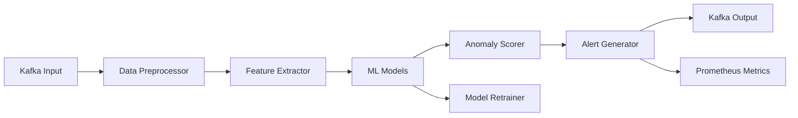

# 🔍 Stream Anomaly Detector

> **Analiza flujos con ML en tiempo real y expone métricas.**

## 📋 **Descripción**

Stream Anomaly Detector es un sistema de detección de anomalías en tiempo real que procesa streams de datos y utiliza machine learning para identificar patrones anómalos. Ideal para detectar fraudes, fallos de sistema, o comportamientos inusuales.

## 🛠️ **Stack Tecnológico**

- **Backend**: FastAPI + Python
- **ML**: TensorFlow Lite + Scikit-learn
- **Streaming**: Kafka + Kafka Consumer
- **Observabilidad**: Prometheus + Grafana
- **Containerización**: Docker

## 🚀 **Características**

- ✅ Detección de anomalías en tiempo real
- ✅ Múltiples algoritmos ML (Isolation Forest, LSTM, Autoencoder)
- ✅ Modelos pre-entrenados y fine-tuning
- ✅ Alertas automáticas con umbrales configurables
- ✅ Métricas de precisión y recall en tiempo real
- ✅ Dashboard de visualización de anomalías
- ✅ API REST para consultas y configuración

## 📊 **Arquitectura**



## 🔧 **Configuración**

### **Variables de Entorno**

```bash
# Kafka
KAFKA_BROKERS=localhost:9092
KAFKA_TOPIC_INPUT=blockchain-events
KAFKA_TOPIC_OUTPUT=anomaly-alerts
KAFKA_GROUP_ID=anomaly-detector

# Modelo ML
MODEL_PATH=/app/models
MODEL_TYPE=isolation_forest  # isolation_forest, lstm, autoencoder
THRESHOLD=0.1
RETRAIN_INTERVAL=3600

# Observabilidad
PROMETHEUS_PORT=9091
LOG_LEVEL=info
```

### **Endpoints de API**

```yaml
POST /api/v1/detect          # Detectar anomalías
GET  /api/v1/models          # Listar modelos
POST /api/v1/models/train   # Entrenar modelo
GET  /api/v1/metrics         # Métricas
GET  /api/v1/health          # Health check
```

## 🚀 **Inicio Rápido**

```bash
# Instalar dependencias
pip install -r requirements.txt

# Configurar variables de entorno
cp .env.example .env

# Descargar modelos pre-entrenados
make download-models

# Levantar en desarrollo
make up

# Ver logs
make logs
```

## 🤖 **Modelos ML Disponibles**

### **1. Isolation Forest**
- **Uso**: Detección de outliers generales
- **Ventajas**: Rápido, no requiere etiquetas
- **Mejor para**: Datos tabulares, detección general

### **2. LSTM Autoencoder**
- **Uso**: Series temporales, secuencias
- **Ventajas**: Captura dependencias temporales
- **Mejor para**: Datos de blockchain, IoT, métricas

### **3. Variational Autoencoder (VAE)**
- **Uso**: Datos complejos, imágenes
- **Ventajas**: Genera representaciones latentes
- **Mejor para**: Datos de alta dimensionalidad

## 📈 **Métricas Prometheus**

- `anomaly_detector_events_processed_total`
- `anomaly_detector_anomalies_detected_total`
- `anomaly_detector_model_accuracy`
- `anomaly_detector_processing_duration_seconds`
- `anomaly_detector_model_confidence_score`

## 🧪 **Testing**

```bash
# Tests unitarios
pytest tests/unit/

# Tests de integración
pytest tests/integration/

# Tests de ML
pytest tests/ml/

# Coverage
pytest --cov=src tests/
```

## 📚 **API Documentation**

### **Detectar Anomalías**

```bash
curl -X POST http://localhost:8001/api/v1/detect \
  -H "Content-Type: application/json" \
  -d '{
    "data": [1.2, 3.4, 5.6, 7.8],
    "model_type": "isolation_forest",
    "threshold": 0.1
  }'
```

### **Entrenar Modelo**

```bash
curl -X POST http://localhost:8001/api/v1/models/train \
  -H "Content-Type: application/json" \
  -d '{
    "model_type": "isolation_forest",
    "training_data": "path/to/data.csv",
    "parameters": {
      "contamination": 0.1,
      "n_estimators": 100
    }
  }'
```

## 🔍 **Monitoreo**

### **Health Check**

```bash
curl http://localhost:8001/api/v1/health
```

### **Métricas**

```bash
curl http://localhost:8001/api/v1/metrics
```

### **Dashboard Grafana**

El proyecto incluye dashboards pre-configurados para:
- Detección de anomalías en tiempo real
- Performance de modelos ML
- Métricas de precisión y recall
- Alertas y notificaciones

## 🐳 **Docker**

```bash
# Construir imagen
docker build -t streamforge/stream-anomaly-detector .

# Ejecutar contenedor
docker run -p 8001:8000 \
  -e KAFKA_BROKERS=localhost:9092 \
  -e MODEL_PATH=/app/models \
  -v $(pwd)/models:/app/models \
  streamforge/stream-anomaly-detector
```

## 📁 **Estructura del Proyecto**

```
stream-anomaly-detector/
├── src/
│   ├── api/              # FastAPI endpoints
│   ├── models/           # Modelos ML
│   ├── processors/       # Procesadores de datos
│   ├── detectors/        # Detectores de anomalías
│   ├── utils/            # Utilidades
│   └── config/           # Configuración
├── models/               # Modelos pre-entrenados
├── data/                 # Datos de entrenamiento
├── tests/                # Tests
├── notebooks/            # Jupyter notebooks
└── docker/              # Configuración Docker
```

## 🎯 **Casos de Uso**

### **Blockchain**
- Detectar transacciones sospechosas
- Identificar patrones de lavado de dinero
- Detectar bots y manipulación de precios

### **IoT**
- Detectar fallos en sensores
- Identificar comportamientos anómalos
- Predecir mantenimiento preventivo

### **E-commerce**
- Detectar fraudes en transacciones
- Identificar bots en compras
- Detectar patrones de abuso

## 🤝 **Contribuir**

1. Fork el proyecto
2. Crea tu feature branch (`git checkout -b feature/AmazingFeature`)
3. Commit tus cambios (`git commit -m 'Add some AmazingFeature'`)
4. Push a la branch (`git push origin feature/AmazingFeature`)
5. Abre un Pull Request

## 📄 **Licencia**

Este proyecto está bajo la Licencia MIT - ver el archivo [LICENSE](LICENSE) para detalles.

---

**Parte del ecosistema StreamForge** 🚀
