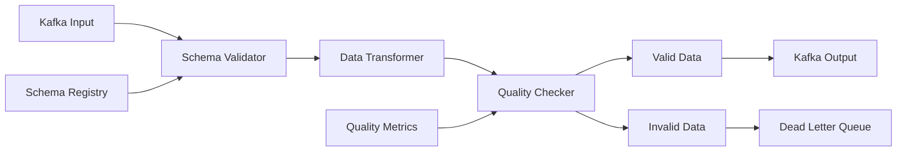

# ✅ Stream Data Validator

> **Validador de datos en tiempo real con esquemas.**

## 📋 **Descripción**

Stream Data Validator es un sistema que valida y transforma datos en tiempo real durante el streaming. Utiliza esquemas Avro/JSON Schema para garantizar la calidad de datos y proporciona dead letter queue para datos inválidos.

## 🛠️ **Stack Tecnológico**

- **Backend**: Go + gRPC
- **Schemas**: Apache Avro + JSON Schema
- **Streaming**: Kafka + Kafka Consumer/Producer
- **Observabilidad**: Prometheus + Grafana
- **Containerización**: Docker

## 🚀 **Características**

- ✅ Validación de esquemas Avro/JSON Schema
- ✅ Transformaciones en tiempo real
- ✅ Dead letter queue para datos inválidos
- ✅ Métricas de calidad de datos
- ✅ Auto-healing de datos corruptos
- ✅ API REST para configuración
- ✅ Dashboard de validación

## 📊 **Arquitectura**



## 🔧 **Configuración**

### **Variables de Entorno**

```bash
# Kafka
KAFKA_BROKERS=localhost:9092
KAFKA_TOPIC_INPUT=blockchain-events
KAFKA_TOPIC_VALID=validated-events
KAFKA_TOPIC_INVALID=invalid-events
KAFKA_GROUP_ID=data-validator

# Schema Registry
SCHEMA_REGISTRY_URL=http://schema-registry:8081
SCHEMA_CACHE_SIZE=1000
SCHEMA_CACHE_TTL=3600

# Validación
VALIDATION_TIMEOUT=30s
MAX_BATCH_SIZE=1000
QUALITY_THRESHOLD=0.95

# Observabilidad
PROMETHEUS_PORT=9091
LOG_LEVEL=info
```

### **Endpoints de API**

```yaml
POST /api/v1/validate              # Validar datos
GET  /api/v1/schemas              # Listar esquemas
POST /api/v1/schemas              # Crear esquema
GET  /api/v1/schemas/{id}         # Obtener esquema
POST /api/v1/transform           # Transformar datos
GET  /api/v1/quality             # Métricas de calidad
GET  /api/v1/invalid             # Datos inválidos
GET  /api/v1/health              # Health check
```

## 🚀 **Inicio Rápido**

```bash
# Instalar dependencias
go mod download

# Configurar variables de entorno
cp .env.example .env

# Levantar en desarrollo
make up

# Ver logs
make logs
```

## 📋 **Esquemas Disponibles**

### **Blockchain Event Schema**
```json
{
  "type": "record",
  "name": "BlockchainEvent",
  "fields": [
    {"name": "blockNumber", "type": "long"},
    {"name": "transactionHash", "type": "string"},
    {"name": "from", "type": "string"},
    {"name": "to", "type": "string"},
    {"name": "value", "type": "string"},
    {"name": "gasPrice", "type": "string"},
    {"name": "timestamp", "type": "long"}
  ]
}
```

### **AI Event Schema**
```json
{
  "type": "record",
  "name": "AIEvent",
  "fields": [
    {"name": "modelId", "type": "string"},
    {"name": "input", "type": "string"},
    {"name": "output", "type": "string"},
    {"name": "confidence", "type": "double"},
    {"name": "processingTime", "type": "double"},
    {"name": "timestamp", "type": "long"}
  ]
}
```

### **IoT Event Schema**
```json
{
  "type": "record",
  "name": "IoTEvent",
  "fields": [
    {"name": "deviceId", "type": "string"},
    {"name": "sensorType", "type": "string"},
    {"name": "value", "type": "double"},
    {"name": "unit", "type": "string"},
    {"name": "location", "type": "string"},
    {"name": "timestamp", "type": "long"}
  ]
}
```

## 📈 **Métricas de Validación**

- `data_validator_events_processed_total`
- `data_validator_events_valid_total`
- `data_validator_events_invalid_total`
- `data_validator_validation_duration_seconds`
- `data_validator_quality_score`
- `data_validator_schema_cache_hits`

## 🧪 **Testing**

```bash
# Tests unitarios
go test ./...

# Tests de integración
go test -tags=integration ./...

# Tests de performance
go test -bench=. ./...

# Coverage
go test -cover ./...
```

## 📚 **API Documentation**

### **Validar Datos**

```bash
curl -X POST http://localhost:8083/api/v1/validate \
  -H "Content-Type: application/json" \
  -d '{
    "data": {
      "blockNumber": 12345,
      "transactionHash": "0x...",
      "from": "0x...",
      "to": "0x...",
      "value": "1000000000000000000",
      "timestamp": 1640995200
    },
    "schema": "blockchain-event-v1"
  }'
```

### **Crear Esquema**

```bash
curl -X POST http://localhost:8083/api/v1/schemas \
  -H "Content-Type: application/json" \
  -d '{
    "name": "custom-event-v1",
    "schema": {
      "type": "record",
      "name": "CustomEvent",
      "fields": [
        {"name": "id", "type": "string"},
        {"name": "value", "type": "double"},
        {"name": "timestamp", "type": "long"}
      ]
    }
  }'
```

### **Transformar Datos**

```bash
curl -X POST http://localhost:8083/api/v1/transform \
  -H "Content-Type: application/json" \
  -d '{
    "data": {"old_field": "value"},
    "transformation": {
      "new_field": "{{.old_field}}",
      "processed_at": "{{.timestamp}}"
    }
  }'
```

## 🔍 **Monitoreo**

### **Health Check**

```bash
curl http://localhost:8083/api/v1/health
```

### **Métricas**

```bash
curl http://localhost:8083/api/v1/metrics
```

### **Dashboard Grafana**

El proyecto incluye dashboards pre-configurados para:
- Calidad de datos en tiempo real
- Esquemas más utilizados
- Datos inválidos por tipo
- Performance de validación

## 🐳 **Docker**

```bash
# Construir imagen
docker build -t streamforge/stream-data-validator .

# Ejecutar contenedor
docker run -p 8083:8080 \
  -e KAFKA_BROKERS=localhost:9092 \
  -e SCHEMA_REGISTRY_URL=http://schema-registry:8081 \
  streamforge/stream-data-validator
```

## 📁 **Estructura del Proyecto**

```
stream-data-validator/
├── src/
│   ├── api/              # gRPC API
│   ├── validators/       # Validadores de esquemas
│   ├── transformers/     # Transformadores de datos
│   ├── processors/       # Procesadores de streams
│   └── utils/            # Utilidades
├── schemas/              # Esquemas predefinidos
├── tests/                # Tests
└── docker/              # Configuración Docker
```

## 🎯 **Casos de Uso**

### **Blockchain**
- Validar transacciones
- Verificar formatos de direcciones
- Validar rangos de valores

### **AI/ML**
- Validar inputs de modelos
- Verificar outputs de predicciones
- Validar formatos de datos

### **IoT**
- Validar lecturas de sensores
- Verificar rangos de valores
- Validar formatos de timestamps

## 🔧 **Configuración Avanzada**

### **Transformaciones**
```yaml
# Configuración de transformaciones
transformations:
  blockchain:
    - field: "value"
      transform: "wei_to_eth"
    - field: "timestamp"
      transform: "unix_to_iso"
  ai:
    - field: "confidence"
      transform: "round_to_2"
    - field: "processingTime"
      transform: "ms_to_seconds"
```

### **Validaciones**
```yaml
# Configuración de validaciones
validations:
  blockchain:
    - field: "transactionHash"
      pattern: "^0x[a-fA-F0-9]{64}$"
    - field: "value"
      range: [0, "max"]
  iot:
    - field: "value"
      range: [-100, 100]
    - field: "timestamp"
      format: "unix"
```

## 🤝 **Contribuir**

1. Fork el proyecto
2. Crea tu feature branch (`git checkout -b feature/AmazingFeature`)
3. Commit tus cambios (`git commit -m 'Add some AmazingFeature'`)
4. Push a la branch (`git push origin feature/AmazingFeature`)
5. Abre un Pull Request

## 📄 **Licencia**

Este proyecto está bajo la Licencia MIT - ver el archivo [LICENSE](LICENSE) para detalles.

---

**Parte del ecosistema StreamForge** 🚀
